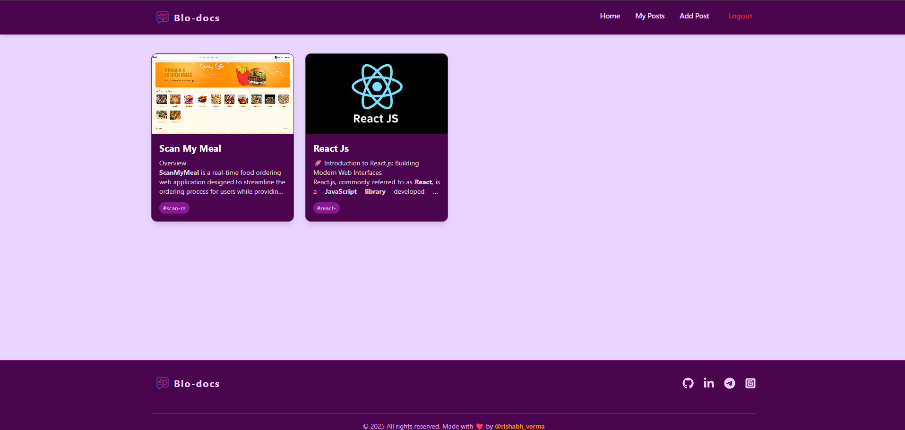
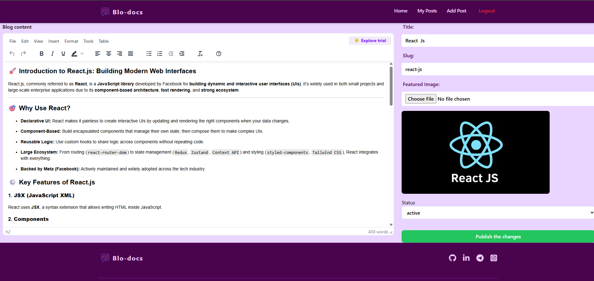
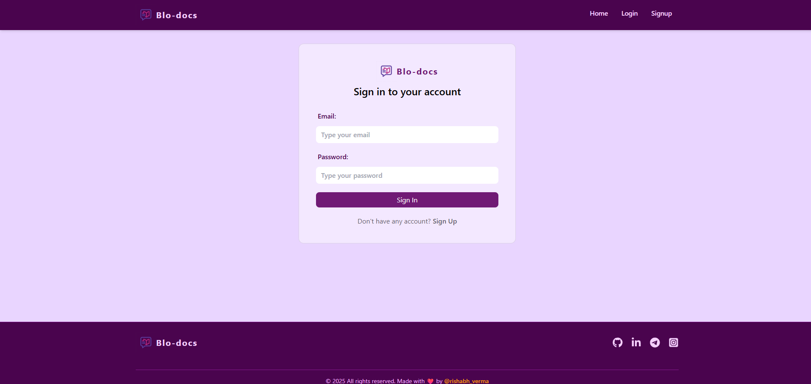
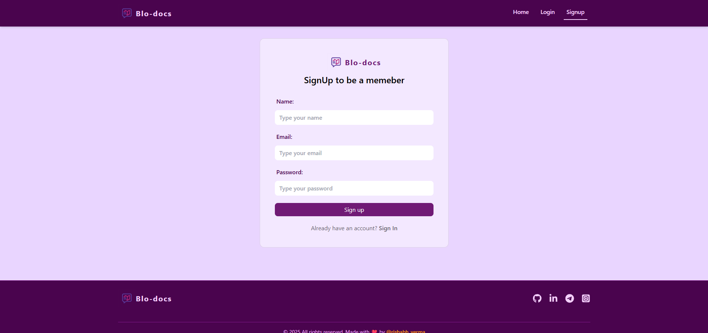

# 📝 Blo-Docs — A Modern Blogging Platform

<h1 align="center" style="display: flex; align-items: center;">
  
  <br/>
  <span style="font-size: 1.8rem; font-weight: semibold; color: #c084fc;">Blo-Docs</span>
</h1>

 **Blo-Docs** is a sleek and modern **blog web application** built with React, powered by **Appwrite** as the backend-as-a-service (BaaS). It allows users to sign up, write rich blog posts, manage their content, and explore posts written by others — even without logging in.

> 💡 A smooth, markdown-friendly, responsive blog experience for readers and writers alike.

---

## 🖼️ Project Preview

| Home Page                             | Editor Page                               | Post Detail                              |
|--------------------------------------|-------------------------------------------|-------------------------------------------|
|  |  |  |

| Login Page                            | Signup Page                               | Blo-Docs                                 |
|---------------------------------------|-------------------------------------------|------------------------------------------|
|  |  | |
---

## 🚀 Tech Stack

| Tech                | Purpose                             |
|---------------------|-------------------------------------|
| `React 19`          | Frontend UI Framework               |
| `Appwrite 1.8+`     | Backend-as-a-Service (BaaS)         |
| `Redux Toolkit`     | Global state management             |
| `React Hook Form`   | Form state & validation             |
| `TinyMCE`           | Rich Text Editing (RTE)             |
| `html-react-parser`| Secure HTML rendering               |
| `SweetAlert2`       | Elegant notifications & confirmations |
| `React Router v7`   | Routing and navigation              |
| `Tailwind CSS`      | Utility-first styling               |

---

## ✨ Key Features

- 🔐 **Authentication**: Login, Signup, Logout
- 📝 **Post Management**: Create, edit, and delete your own posts
- 👥 **Public Reading**: Posts are visible to all users, even without login
- 🧠 **Rich Text Editing**: Blog content with headings, images, and HTML via TinyMCE
- 📦 **File Storage**: Upload featured images via Appwrite Bucket
- 🗂️ **Post Slugs**: Auto-generated slugs for unique blog URLs
- ⚡ **Live Feedback**: Form validations and submission alerts
- 🎨 **Skeleton Loaders**: For better loading UX

---

## 📦 Getting Started

### 1️⃣ Clone the Repository

```bash
git clone https://github.com/your-username/blo-docs.git
cd blo-docs
```

## create *.env* file with following variables
```bash
VITE_APPWRITE_URL = ""
VITE_APPWRITE_PROJECT_ID = ""
VITE_APPWRITE_DATABASE_ID = ""
VITE_APPWRITE_COLLECTION_ID = ""
VITE_APPWRITE_BUCKET_ID = ""
VITE_TINYMCE_API_KEY = ""
``` 